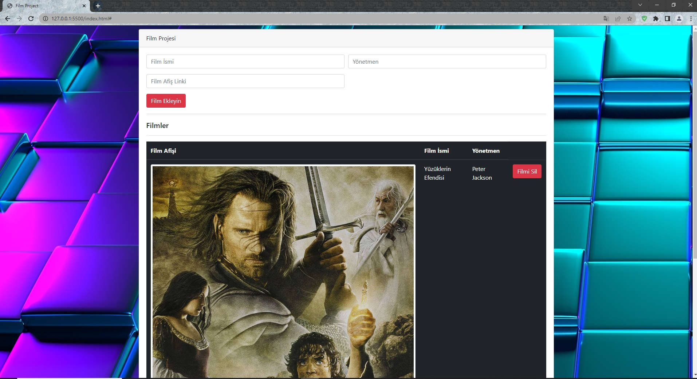

# JavaScript ES6 Film Projesi
Kullanıcı bu projede formlar aracılığıyla film bilgilerini girebilir, film arşivini görsel formatında yükleyebilir. Girilen bilgiler ve yüklenen görseller local storage'a kaydedilip arayüz üzerinden kullanıcılara gösterilir. Kullanıcı dilerse eklediği filmleri tek tek silebilir ya da tümünü birden silebilir. Kullanıcı tümünü silmek istediğinde uyarı penceresi ekrana gelir. Kullanıcı onay verdiği takdirde tüm filmler silinir. ES6 standardı ve DOM manipülasyonu kullanılmıştır.

# JavaScript ES6 Movie Project
In this project, the user can enter movie information through forms and upload the movie archive in visual format. The entered information and uploaded images are saved to local storage and shown to users via the interface. If the user wishes, he can delete the added movies one by one or all at once. When the user wants to delete all, a warning window appears. If the user gives approval, all movies are deleted. ES6 standard and DOM manipulation are used.

